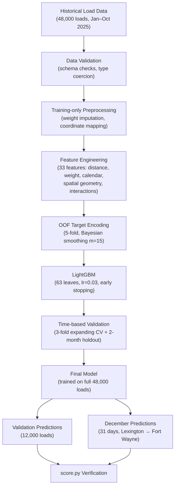

# Pipeline Flow

```mermaid
flowchart TD
    A["Historical Load Data<br/>(48,000 loads, Jan–Oct 2025)"] --> B["Data Validation<br/>(schema checks, type coercion)"]
    B --> C["Training-only Preprocessing<br/>(weight imputation, coordinate mapping)"]
    C --> D["Feature Engineering<br/>(33 features: distance, weight, calendar,<br/>spatial geometry, interactions)"]
    D --> E["OOF Target Encoding<br/>(5-fold, Bayesian smoothing m=15)"]
    E --> F["LightGBM<br/>(63 leaves, lr=0.03, early stopping)"]
    F --> G["Time-based Validation<br/>(3-fold expanding CV + 2-month holdout)"]
    G --> H["Final Model<br/>(trained on full 48,000 loads)"]
    H --> I["Validation Predictions<br/>(12,000 loads)"]
    H --> J["December Predictions<br/>(31 days, Lexington → Fort Wayne)"]
    I --> K["score.py Verification"]
    J --> K
```
