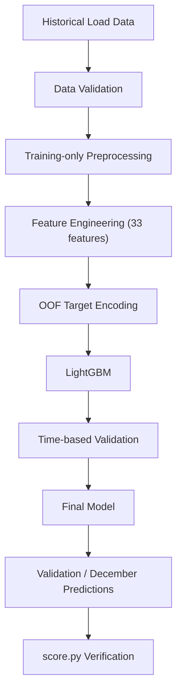
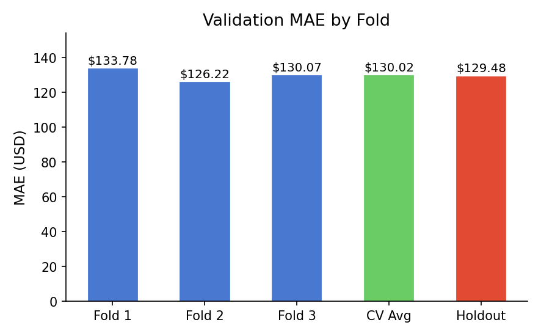
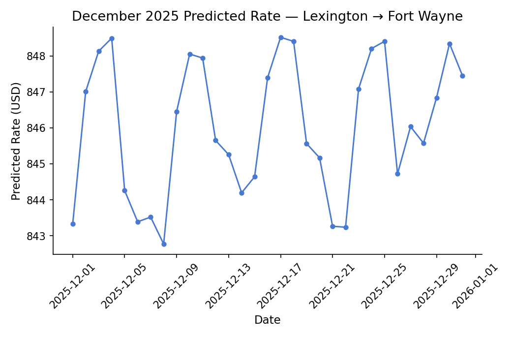

# Freight Rate Prediction

## Overview

This repository implements a machine learning system to predict spot freight load rates (`posted_rate` in USD) for full truckload freight transactions. The model is trained on 48,000 historical loads spanning January to October 2025 to predict rates for 12,000 unlabelled loads in November and December 2025, alongside a 31-day December benchmark sequence on a fixed shipping corridor.

## Data Files

The assessment datasets are not included in this repository. Place the provided CSV files in the repository root before running the training pipeline.

## Approach

- **LightGBM regression:** Gradient boosted decision trees configured with 63 leaves, 0.03 learning rate, feature/bagging subsampling, and shrinkage regularization.
- **Time-based validation:** Expanding-window chronological cross-validation and a 2-month out-of-time holdout approximating the final November–December forecast horizon.
- **Feature engineering:** 33 features covering distance, weight, equipment premiums, cyclical calendar encodings, spatial geometry, and baseline rate estimates.
- **OOF target encoding:** 5-fold out-of-fold target encoding with Bayesian smoothing ($m=15.0$) on origin and destination cities to prevent target leakage.
- **Training-only preprocessing:** All imputation parameters and coordinate mappings are fitted strictly on training data and frozen before inference.

## Validation

The validation protocol enforces strict chronological order to avoid lookahead bias inherent in random splitting:

1. **Expanding-Window Cross-Validation (3 Folds):**
   - Fold 1: Train Jan–Jul $\to$ Validate Aug
   - Fold 2: Train Jan–Aug $\to$ Validate Sep
   - Fold 3: Train Jan–Sep $\to$ Validate Oct
2. **2-Month Out-of-Time Holdout:**
   - Train Jan–Aug $\to$ Validate Sep–Oct (evaluates a contiguous 2-month future horizon matching November–December).
3. **Preprocessing Isolation:** All pipeline parameters are fitted strictly on each fold's training window.

## Project Structure

```text
Spotter-ML-Assessment/
│
├── README.md                           # Project documentation
├── requirements.txt                    # Python dependencies
├── train_model.py                      # Main training and prediction pipeline
├── score.py                            # Official Spotter verification script
│
├── src/                                # Source package
│   ├── __init__.py
│   ├── config.py                       # Paths, hyperparameters, and constants
│   ├── features.py                     # Deterministic feature engineering routines
│   ├── preprocessing.py                # Preprocessing pipeline and transformation logic
│   ├── encoding.py                     # OOF target encoding with Bayesian smoothing
│   ├── model.py                        # LightGBM model definition and training
│   ├── validation.py                   # Expanding CV, holdout, and evaluation metrics
│   └── predict.py                      # Prediction generation and schema validation
│
├── reports/
│   └── Spotter_ML_Assessment_Report.pdf # Technical assessment report
│
├── notebooks/
│   └── 01_analysis_and_experiments.ipynb # Analysis and experiment documentation
│
├── docs/
│   └── pipeline_flow.md                # Mermaid pipeline diagram
│
├── assets/                             # Generated visualizations
│   ├── target_distribution.png
│   ├── distance_vs_rate.png
│   ├── validation_performance.png
│   └── december_forecast.png
│
├── scorer_results/
│   └── candidate_december.png          # Generated December chart from score.py
│
├── validation_predictions.csv          # Predictions for 12,000 validation loads
└── december_predictions.csv            # Predictions for 31 December benchmark days
```

## Setup

Ensure Python 3.10+ is installed, then install dependencies:

```bash
pip install -r requirements.txt
```

## Run

Run the full training pipeline, generate predictions, and run the official scorer:

```bash
python train_model.py
```

To run the standalone scorer on existing prediction files:

```bash
python score.py --predictions validation_predictions.csv --december-predictions december_predictions.csv
```

## Outputs

- `validation_predictions.csv`: 12,000 rows containing `load_id,predicted_rate` matching `validation.csv` IDs in identical order.
- `december_predictions.csv`: 31 rows with original 7 columns for the fixed Lexington $\to$ Fort Wayne corridor across December 2025.
- `scorer_results/candidate_december.png`: Fixed-route visualization produced by `score.py`.

## Results

All reported metrics reflect historical development evaluations. Spotter computes the official validation score post-submission against ground-truth holdout rates.

- **CV 3-Fold Average:**
  - MAE: **$130.02**
  - RMSE: **$632.87**
  - R²: **0.8239**
  - MAPE: **6.14%**
  - MedAE: **$47.23**
- **Sep–Oct Holdout (2 Months):**
  - MAE: **$129.48**
  - RMSE: **$635.27**
  - R²: **0.8267**
  - MAPE: **5.96%**
  - MedAE: **$44.84**

## Analysis & Documentation

- [`notebooks/01_analysis_and_experiments.ipynb`](notebooks/01_analysis_and_experiments.ipynb) — EDA, feature engineering, model experiments, and validated results
- [`docs/pipeline_flow.md`](docs/pipeline_flow.md) — Mermaid pipeline diagram

## Pipeline



## Validation Performance



## December Forecast



## Limitations

- **Post-Submission Evaluation:** Official validation performance is evaluated by Spotter after submission; development scores are empirical estimates.
- **October Cutoff:** Development data ends on October 31, 2025.
- **Holiday Effects:** December holiday effects, including Christmas and New Year's Eve, are not directly represented in the training data. Predictions therefore rely on the calendar patterns learned from January through October.
